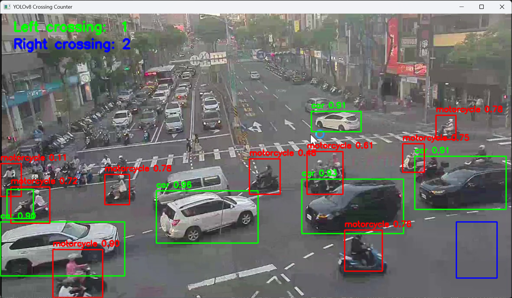

# traffic_detection_yolo

車輛種類辨識與車流偵測

可在hugging face測試
https://huggingface.co/spaces/uchen3/traffic_yolo

## 安裝環境
python 3.11.13

```bash
pip install -r requirements.txt
```
## 執行
自備.mp4到資料夾
影片開始前選取車子通過區塊 左上拉到右下 兩次

```bash
python main.py
```
## 預覽

